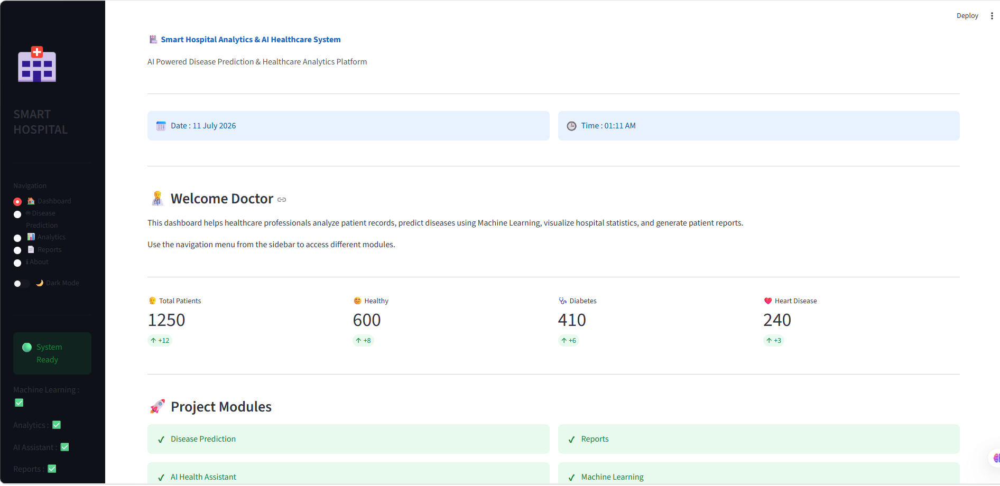
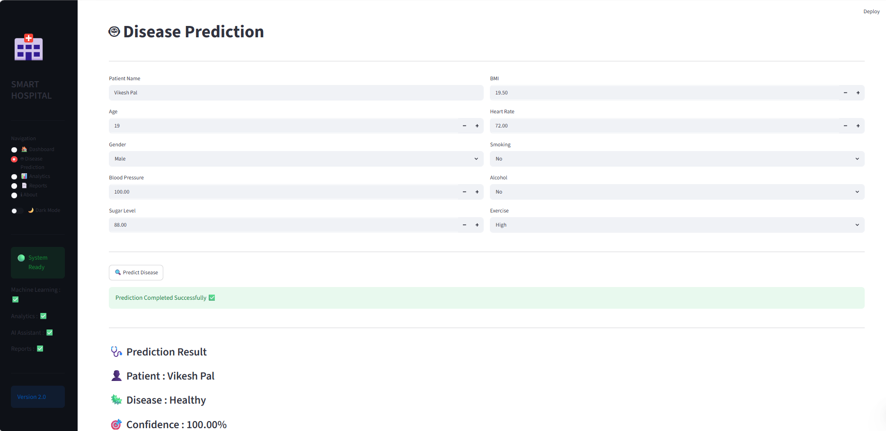
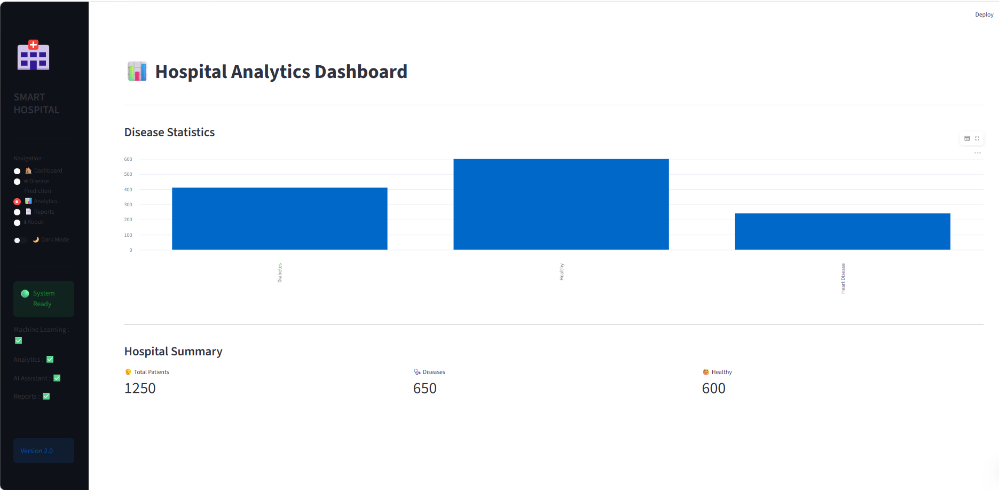
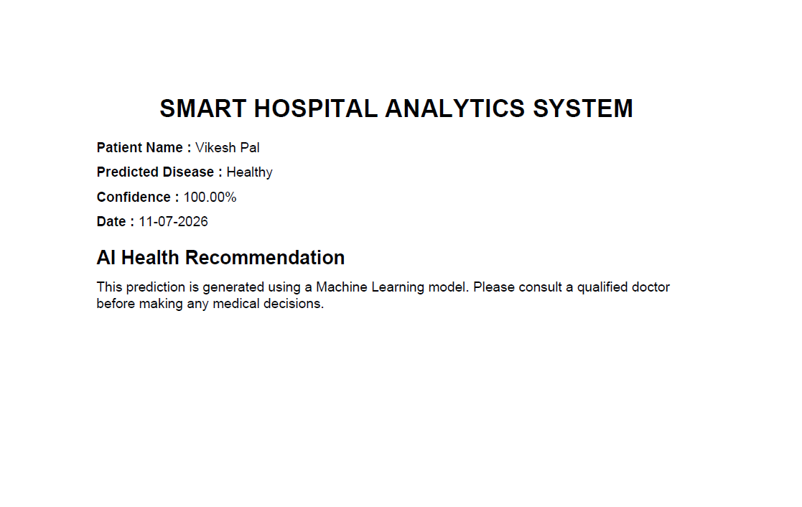

# 🏥 Smart Hospital Analytics System

A Smart Hospital Analytics System built using Python, Streamlit, Machine Learning, and Scikit-learn. The project helps analyze hospital data, visualize insights, and predict diseases using patient health information.

---

## ✨ Features

- 📊 Interactive Dashboard
- 🤖 Disease Prediction using Machine Learning
- 📈 Patient Data Analytics
- 📉 Data Visualization
- 📄 PDF Report Generation
- 📋 Hospital Statistics
- 💬 AI Health Assistant
- 🌙 Dark Mode Interface

---

## 🛠 Tech Stack

| Technology | Purpose |
|------------|---------|
| Python | Backend |
| Streamlit | Web Dashboard |
| Pandas | Data Processing |
| NumPy | Numerical Operations |
| Matplotlib | Data Visualization |
| Scikit-learn | Machine Learning |
| Joblib | Model Saving |
| ReportLab | PDF Report Generation |

---

## 📂 Project Structure

```
Smart-Hospital-Analytics-System/
│
├── dataset/
│   └── hospital_data.csv
│
├── models/
│   ├── disease_prediction_model.pkl
│   └── prediction.py
│
├── app.py
├── analysis.py
├── data_cleaning.py
├── feature_engineering.py
├── model.py
├── visualization.py
├── requirements.txt
├── README.md
└── .gitignore
```

---

## 🚀 Installation

### Clone Repository

```bash
git clone https://github.com/Vikeshpal/Smart-Hospital-Analytics-System.git
```

### Open Project

```bash
cd Smart-Hospital-Analytics-System
```

### Install Required Libraries

```bash
pip install -r requirements.txt
```

### Run the Application

```bash
streamlit run app.py
```

---

## 📷 Screenshots

## Dashboard



## Disease Prediction



## Analytics



## Report



---

## 📊 Machine Learning Model

- Algorithm Used:
  - Decision Tree Classifier

Input Features

- Age
- Gender
- Blood Pressure
- Sugar Level
- BMI
- Heart Rate
- Smoking
- Alcohol
- Exercise

Output

- Healthy
- Diabetes
- Heart Disease

---

## 📈 Future Improvements

- User Login Authentication
- Doctor Dashboard
- Appointment Booking
- Cloud Database Integration
- Email Report Generation
- Mobile Responsive UI
- Real-time Hospital Analytics

---

## 👨‍💻 Author

**Vikesh Pal**

B.Tech – Artificial Intelligence & Data Science

IES College of Technology, Bhopal

📧 Email: vikeshssm569@gmail.com

🔗 LinkedIn:
https://www.linkedin.com/in/vikesh-pal-5a1b85303

GitHub:
https://github.com/Vikeshpal
---

# 📄 License

This project is licensed under the MIT License.

# ⭐ Support

If you like this project, please give it a ⭐ on GitHub.